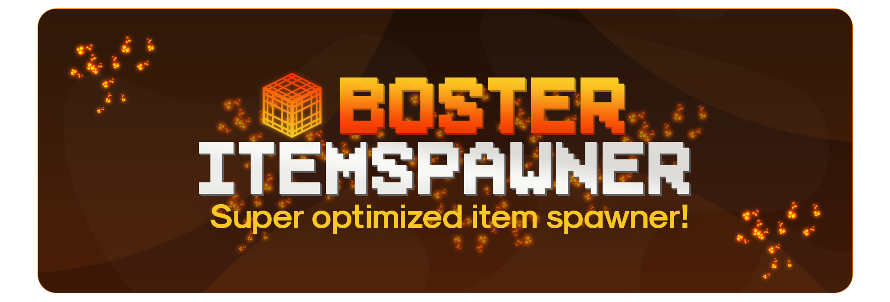

[![Contributors][contributors-shield]][contributors-url]
[![Forks][forks-shield]][forks-url]
[![Stargazers][stars-shield]][stars-url]
[![Issues][issues-shield]][issues-url]
[![MIT License][license-shield]][license-url]
[![LinkedIn][linkedin-shield]][linkedin-url]

<!-- PROJECT LOGO -->
 

  
  
<h3 align="center">BosterItemSpawner</h3>

  

     
    <a href="https://github.com/Bosternike/BosterItemSpawner/wiki"><strong>Explore the docs »</strong></a>
     
     
    <a href="https://github.com/Bosternike/BosterItemSpawner/issues">Report Bug</a>
    ·
    <a href="https://discord.gg/vAkXjrsf3E">Request Feature</a>
  

<!-- DEPENDENCIES -->
## Dependencies

<li>Holographic Displays: https://dev.bukkit.org/projects/holographic-displays</li>

<!-- CONTACT -->
## Contact

<li>LinkedIn: <a href="https://www.linkedin.com/in/vlasov-andrii/">Andrew</a></li>

[contributors-shield]: https://img.shields.io/github/contributors/Bosternike/BosterItemSpawner.svg?style=for-the-badge
[contributors-url]: https://github.com/Bosternike/BosterItemSpawner/graphs/contributors
[forks-shield]: https://img.shields.io/github/forks/Bosternike/BosterItemSpawner.svg?style=for-the-badge
[forks-url]: https://github.com/Bosternike/BosterItemSpawner/network/members
[stars-shield]: https://img.shields.io/github/stars/Bosternike/BosterItemSpawner.svg?style=for-the-badge
[stars-url]: https://github.com/Bosternike/BosterItemSpawner/stargazers
[issues-shield]: https://img.shields.io/github/issues/Bosternike/BosterItemSpawner.svg?style=for-the-badge
[issues-url]: https://github.com/Bosternike/BosterItemSpawner/issues
[license-shield]: https://img.shields.io/github/license/Bosternike/BosterItemSpawner.svg?style=for-the-badge
[license-url]: https://github.com/Bosternike/BosterItemSpawner/blob/main/LICENSE.md
[linkedin-shield]: https://img.shields.io/badge/-LinkedIn-black.svg?style=for-the-badge&logo=linkedin&colorB=555
[linkedin-url]: https://www.linkedin.com/in/vlasov-andrii/
